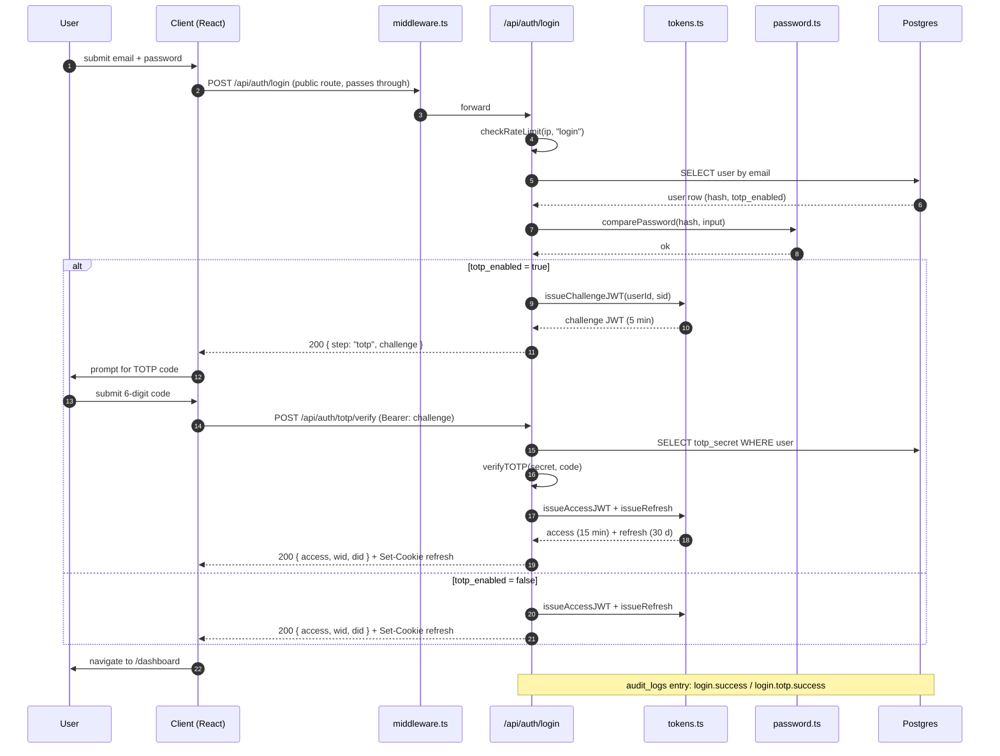
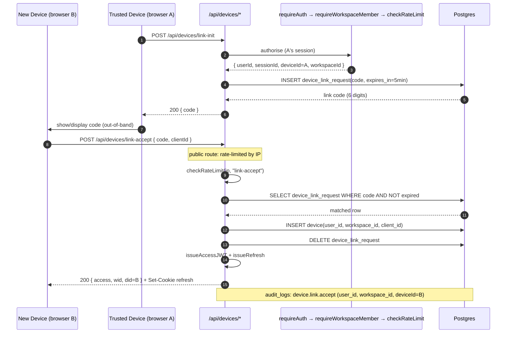
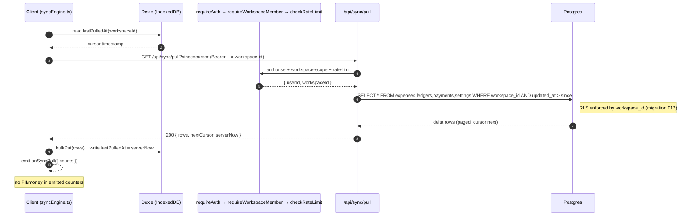
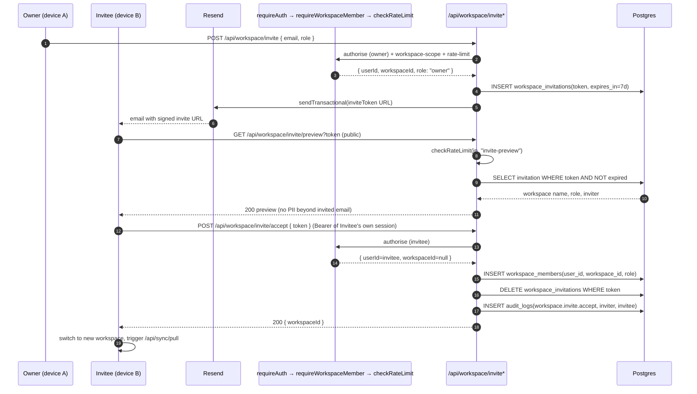

<!--
  ARCHITECTURE_DIAGRAMS.md — Mermaid sequence diagrams for ExpenStream critical flows
  Owner: AI Engineering Team
  Audience: Engineers, security reviewers, AI agents, new contributors.
  Companion docs: ARCHITECTURE.md (narrative), AI_CONTEXT.md (rules),
                  IMPLEMENTATION_QUEUE.md (task references).
  Rule: Every critical flow labels the guard chain
        `requireAuth → requireWorkspaceMember → checkRateLimit`.
        Diagrams render in GitHub Markdown (Mermaid live preview supported).
-->

# ExpenStream — Architecture Diagrams

**Status:** Living document · **Version:** 1.0 · **Last reviewed:** 2026-07-23

Sequence diagrams for the six critical flows in ExpenStream. Complements the narrative in [ARCHITECTURE.md](ARCHITECTURE.md). Every diagram deliberately shows the guard chain used by every mutation route (`requireAuth → requireWorkspaceMember → checkRateLimit`), because a new engineer or AI agent should never need to guess the middleware order.

Notation:

- Server modules live in `src/lib/server/**` (see [ARCHITECTURE.md §11](ARCHITECTURE.md)).
- Client modules live in `src/lib/**` and `src/hooks/**`.
- Guards: `requireAuth` (in [`guards.ts`](../src/lib/server/)), `requireWorkspaceMember`, `checkRateLimit` ([`rateLimit.ts`](../src/lib/server/)).
- Postgres tables live behind Supabase RLS (migration [`012_enable_rls_all_tables.sql`](../prisma/migrations/012_enable_rls_all_tables.sql)).

---

## 1. Login → TOTP (2FA) challenge



---

## 2. Device-link accept (multi-device continuity)



---

## 3. Sync pull (delta)



---

## 4. Mutation commit (write path with idempotency)

```mermaid
sequenceDiagram
    autonumber
    participant U as User
    participant C as Client (hooks + syncEngine.ts)
    participant IDB as Dexie mutation queue
    participant Guards as requireAuth → requireWorkspaceMember → checkRateLimit
    participant API as /api/sync/commit
    participant DB as Postgres

    U->>C: add expense (offline or online)
    C->>IDB: enqueue mutation { idempotencyKey, op, payload }
    IDB-->>C: queued
    C->>C: syncEngine drain (on connect / interval / visibility)

    loop until empty or terminal error
        C->>API: POST /api/sync/commit { idempotencyKey, op, payload }
        API->>Guards: authorise + workspace-scope + rate-limit
        Guards-->>API: { userId, workspaceId }
        API->>DB: SELECT WHERE workspace_id AND idempotency_key = ?
        alt already committed
            DB-->>API: existing row
            API-->>C: 200 { row, deduped: true }
        else new
            API->>DB: INSERT/UPDATE row (RLS enforced)
            API->>DB: INSERT audit_logs (op, workspace_id)
            DB-->>API: committed row
            API-->>C: 200 { row }
        end
        C->>IDB: mark mutation as delivered (or backoff on 5xx)
    end

    Note over C,API: Persistent queue + unique(workspace_id, idempotency_key) → Sprint 2.2 (T-2.2.*).
    Note over C: On 401 → onWorkspaceAccessDenied; on 409 → conflict resolver (Sprint 2.3).
```

---

## 5. Workspace invite accept



---

## 6. Web Push send (server-scheduled)

```mermaid
sequenceDiagram
    autonumber
    participant Cron as Vercel cron
    participant Route as /api/push/send
    participant Guards as (cron key) → checkRateLimit
    participant DB as Postgres
    participant WP as web-push (VAPID)
    participant Dev as User device (SW)

    Cron->>Route: POST /api/push/send (X-Cron-Key)
    Route->>Guards: verifyCronKey + checkRateLimit(cron)
    Guards-->>Route: authorised as cron
    Route->>DB: SELECT push_subscriptions JOIN notification_prefs WHERE quiet_hours=false AND due
    DB-->>Route: subscriptions batch
    loop for each subscription
        Route->>WP: sendNotification(sub, payload)
        alt 201 Created
            WP-->>Route: ok
        else 410 Gone / 404 Not Found
            Route->>DB: DELETE push_subscriptions WHERE endpoint=?
        else other error
            Route->>Route: syncErr → Sentry (no PII)
        end
    end
    Route-->>Cron: 200 { sent, pruned }

    WP-->>Dev: push event
    Dev->>Dev: SW showNotification (title only; no monetary values in body)
    Dev->>Dev: on click → open app / relevant route
    Note over Dev: quiet-hours enforced client-side too (Sprint 3.2 hardens tz correctness).
```

---

## Notes

- Diagrams use **Mermaid** and render natively in GitHub Markdown preview and VS Code.
- Every mutation route must, in order: `requireAuth → requireWorkspaceMember → checkRateLimit → Zod validate → handler → Prisma`. See [ARCHITECTURE.md §4.1](ARCHITECTURE.md).
- Public routes (login, invite preview, VAPID key, cron push) **skip `requireAuth`** but must still call `checkRateLimit`.
- `audit_logs` writes are documented per-flow. See [`audit.ts`](../src/lib/server/) for the schema (event, actor, workspace, ip_hash).
- Diagrams intentionally omit monetary values, remarks, and email content — see the "no PII / no money in observability" rule in [AI_CONTEXT.md §18](AI_CONTEXT.md).

**Last reviewed:** 2026-07-23
